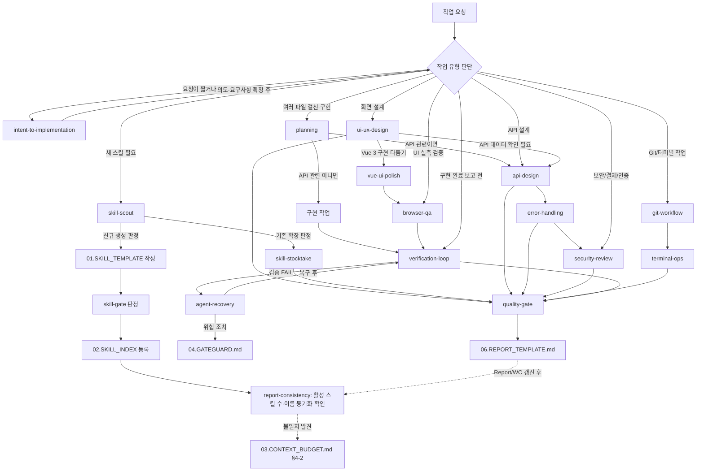

# 02. SKILL INDEX

> 목적: 현재 하네스에서 사용하는 스킬 목록, 담당 역할, 연결 구조를 관리한다.  

---

## 1. 스킬 사용 전제

일반 작업에서 스킬을 선택하기 전에는 `00.QUICK_REF.md`를 우선 확인한다. 스킬은 하네스 하위 모듈이며, 충돌 시 Quick Ref와 `00.HARNESS_RULES.md §3` 우선순위를 따른다.

---

## 1-1. 스킬 대분류

스킬이 늘어날수록 나열만으로는 구조가 무너지기 쉽다. 새 스킬을 추가할 때는 먼저 아래 3개 대분류 중 하나로 분류한다.

| 대분류 | 정의 | 예시 |
|---|---|---|
| 문서 스킬 | 명세, 설계, 검수 등 산출물이 문서인 스킬 | `api-design`, `security-review`, `planning`, `ui-ux-design` |
| 코드 스킬 | 실제 구현/실행/검증이 산출물인 스킬 | `git-workflow`, `terminal-ops`, `verification-loop` |
| 운영 스킬 | 하네스 자체의 관리, 실패 복구, 스킬 목록 관리가 산출물인 스킬 | `skill-scout`, `skill-stocktake`, `quality-gate`, `agent-recovery`, `report-consistency` |

대분류는 §2 목록의 "구분" 열에 표시하며, 앞으로 추가되는 스킬도 이 3개 중 하나로 분류한다. 새 대분류가 필요해 보이면 먼저 `skills/skill-scout/SKILL.md`로 기존 대분류로 흡수할 수 있는지 확인한다.

---

## 2. 현재 활성 스킬 목록

| 번호 | 스킬 | 구분 | 상태 | 담당 영역 | 핵심 Trigger |
|---:|---|---|---|---|---|
| 1 | `skill-scout` | 운영 | Active | 스킬 탐색 | 새 스킬을 만들기 전 기존 스킬을 확인할 때 |
| 2 | `skill-stocktake` | 운영 | Active | 스킬 재고조사 | 스킬 목록이 늘어나거나 품질 검수가 필요할 때 |
| 3 | `quality-gate` | 운영 | Active | 통과/경고/실패 판정 | 산출물을 다음 단계로 넘기기 전 |
| 4 | `planning` | 문서 | Active | 구현 전 계획 | 여러 파일에 걸친 구현을 시작하기 전 |
| 5 | `api-design` | 문서 | Active | API 설계 | URL, Method, Request, Response를 정리할 때 |
| 6 | `git-workflow` | 코드 | Active | Git 협업 | 브랜치, 커밋, 병합, 충돌 흐름을 정리할 때 |
| 7 | `error-handling` | 문서 | Active | 예외/응답 | 에러 응답, 예외 처리, 실패 케이스를 설계할 때 |
| 8 | `terminal-ops` | 코드 | Active | 터미널 실행 | 명령 실행 전후 증거와 안전성을 기록할 때 |
| 9 | `security-review` | 문서 | Active | 보안 검수 | 인증, 권한, 결제, 민감정보 기능을 검수할 때 |
| 10 | `verification-loop` | 코드 | Active | 구현 검증 | 구현 완료를 보고하기 전 빌드/검사/테스트/명세 일치를 확인할 때 |
| 11 | `agent-recovery` | 운영 | Active | 실패 복구 | Agent가 반복 실패하거나 방향을 잃었을 때 |
| 12 | `report-consistency` | 운영 | Active | 최신성 동기화 점검 | Report/Working Context/Skill Index의 현재 기준이 어긋나지 않는지 확인할 때 |
| 13 | `ui-ux-design` | 문서 | Active | 화면 설계 | 새 화면/화면 흐름을 설계하거나 기존 화면에 상태·반응형 대응이 빠져있을 때 |
| 14 | `intent-to-implementation` | 문서 | Active | 요청 해석·요구사항 재구성 | 요청이 짧거나 불완전해 의도 분류와 요구사항 재구성이 먼저 필요할 때, 또는 변경 설명을 요청받을 때 |
| 15 | `browser-qa` | 코드 | Active | 브라우저 실측 검증 | UI 구현·수정 후 자동화 도구로 치수·상태·접근성 수치를 실측해 재현 가능하게 기록할 때 |
| 16 | `vue-ui-polish` | 코드 | Active | Vue UI 다듬기(스택 한정) | **Vue 3 프로젝트에서만** UI/UX·반응형·모션을 검토·개선할 때. 다른 스택에서는 존재 무시(ADR-043) |

---

## 3. 스킬 연결 구조

스킬이 늘어나 다이어그램이 복잡해지면 대분류(문서/코드/운영) 단위로 상위 노드를 먼저 그리고, 세부 스킬은 §2 표로만 관리하는 방식으로 축약한다. §1-1 대분류 정의가 이 축약의 기준이다.

---

## 4. 스킬 사용 우선순위

| 상황 | 우선 스킬 | 보조 스킬 |
|---|---|---|
| 요청이 짧거나 의도·범위가 불명확 | `intent-to-implementation` | `planning`(여러 파일 구현으로 이어질 때) |
| 완료된 변경의 설명 요청 | `intent-to-implementation`(변경 설명 절차) | — |
| 새 스킬을 만들지 고민 중 | `skill-scout` | `skill-stocktake` |
| 여러 파일 걸친 구현 시작 전 | `planning` | `api-design`(API 관련이면) |
| API 명세 작성 | `api-design` | `error-handling`, `security-review` |
| 화면/화면 흐름 설계 | `ui-ux-design` | `api-design`(데이터 확인 필요 시), `security-review`(민감 화면 시) |
| 결제/로그인/권한 기능 | `security-review` | `quality-gate`, `error-handling` |
| DB/API/SRS 산출물 검수 | `quality-gate` | 해당 gate/checklist |
| Git 충돌/브랜치 병합 | `git-workflow` | `terminal-ops` |
| Report/Working Context/Skill Index 최신성 점검 | `report-consistency` | `scripts/validate-report-consistency.mjs` |
| 터미널 명령 실행 | `terminal-ops` | `security-review` |
| Vue 3 화면의 UI 다듬기·모션 작업 | `vue-ui-polish`(스택 한정) | `browser-qa`, `ui-ux-design`(설계가 필요해지면) |
| UI 구현·수정 후 브라우저 실측 검증 | `browser-qa` | `verification-loop`, `ui-ux-design` |
| 구현 완료 보고 전 | `verification-loop` | `agent-recovery`(FAIL 시) |
| Agent 반복 실패/방향 상실 | `agent-recovery` | `04.GATEGUARD.md`(위험 조치 판단) |
| 파일 이동·폴더 구조 변경 | `git-workflow` | `planning`, `terminal-ops`, `04.GATEGUARD.md`(구조 위험 판정) |
| XL 작업 또는 L 이상 구조 작업 시작 전 | `planning` | `04.GATEGUARD.md` |

---

## 5. 스킬 추가 기준

새 스킬은 아래 조건을 만족할 때만 추가한다.

| 조건 | 설명 |
|---|---|
| 반복성 | 비슷한 작업이 3회 이상 반복될 가능성이 있음 |
| 독립성 | 기존 스킬의 한 섹션으로 처리하기 어려움 |
| 검증성 | PASS/WARN/FAIL 기준을 만들 수 있음 |
| 연결성 | 기존 스킬, 게이트, 리포트 중 하나 이상과 연결됨 |
| 유지보수성 | 스킬 하나가 너무 많은 역할을 갖지 않음 |

---

## 6. 현재 보류 스킬 후보

보류 스킬 후보의 Source of Truth는 `_PENDING_IMPORT_LIST.md`(§1 C등급, §2 D등급)다. 이 문서는 그 목록을 복제하지 않는다. 후보를 실제로 추가할 때는 `skill-scout` 판정 후 `_PENDING_IMPORT_LIST.md`의 등급을 갱신하고 이 문서 §2에 등록한다.

---

## 7. 외부 반입 이력

`verification-loop`, `agent-recovery` 스킬과 §1-1 대분류는 외부 참고자료를 재작성해 반입한 것이다. `planning` 스킬(Spec/Non-Goals/Task 분해 패턴)과 `verification-loop`의 SKIP=FAIL 원칙도 외부 참고자료를 재작성해 반입했다. `report-consistency` 스킬은 외부 검수 피드백(`GENERAL_HARNESS_REPAIR_AND_SKILL_ROADMAP.md`)의 제안을 이 하네스 스킬 템플릿에 맞춰 재작성 반입했다. `intent-to-implementation` 스킬은 외부 제공 스킬 패키지를 P-16 축소안(기존 문서와 중복되는 절차 제거, 고유 가치 4종만 유지)에 따라 한국어 하네스 표준으로 재작성 반입했다. `browser-qa`는 D등급 장기 보류였다가 실사용 반복(Report 10건 중 5회)과 자동화 도구 사용이 확인되어 정식 승격했다(ADR-042). `vue-ui-polish`는 Emil Kowalski의 MIT 원본을 Vue 중심으로 재구성한 외부 파생 스킬을 스택 한정 스킬 범주로 반입한 것이다(ADR-043, LICENSE 동반). 반입 근거와 반영 방식은 `_SOURCE_MAPPING.md`를, 반입하지 않고 보류/제외한 항목은 `_PENDING_IMPORT_LIST.md`를 따른다. 이 문서에는 반입 근거를 중복 기록하지 않는다.
