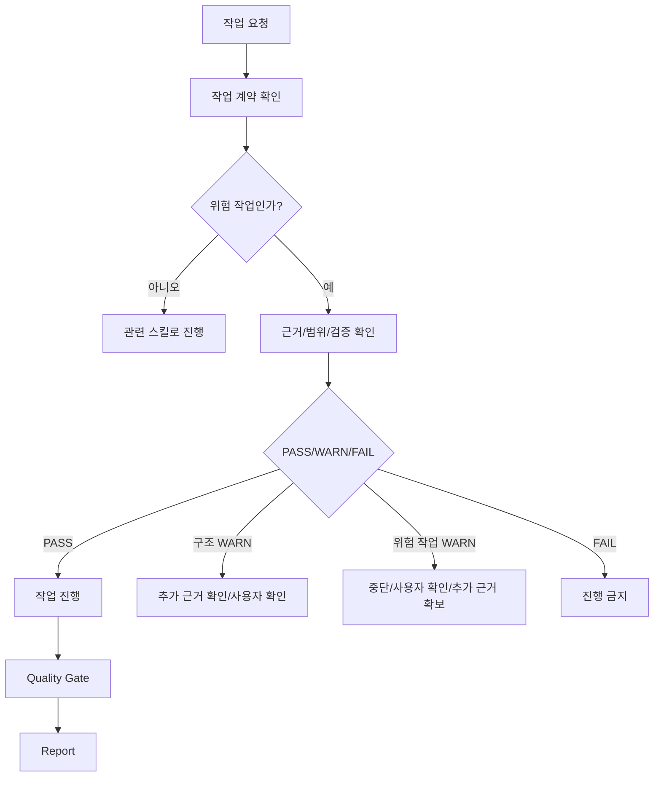

# 04. GATEGUARD

> 한국어 별칭: 작업 전 안전 게이트  
> 목적: 수정·생성·삭제 작업 전에 근거를 확인하고, 추측 기반 변경을 막는다.  

---

## 1. GateGuard의 역할

GateGuard는 작업을 막기 위한 문서가 아니라, **잘못된 전제에서 작업을 시작하지 않도록 막는 안전장치**다.

주요 역할:

- 근거 없는 파일 수정 방지
- 불필요한 구조 변경 방지
- 사용자 변경 덮어쓰기 방지
- 위험 명령 실행 전 확인
- 문서 규칙 충돌 확인
- 결제/보안/인증 기능의 가벼운 처리 방지

---

## 2. 작업 계약 최소 항목

작업 시작 전 최소한 아래 항목을 확정한다.

| 항목 | 질문 |
|---|---|
| 목표 | 이번 작업의 완료 기준은 무엇인가? |
| 수정 대상 | 실제로 수정/생성/검수할 파일·폴더·산출물은 무엇인가? |
| 제외 대상 | 지금 만들지 않거나 건드리지 않을 것은 무엇인가? |
| 근거 | 어떤 문서/파일/대화 내용에 근거하는가? |
| 적용 스킬/Gate | 어떤 스킬과 Gate/Checklist로 판단하는가? |
| 위험도 | 일반 / 구조 / DB / 보안 / 결제 / 파일 손상 가능 / 외부 실행 / 환경 변경(비파괴적) 중 어디에 해당하는가? |
| 검증 방법 | 무엇으로 PASS/WARN/FAIL을 판단하는가? |

작업 계약이 모호한 상태에서 위험 작업을 진행하지 않는다.

---

## 3. 작업 전 확인 항목

이 표는 §2 작업 계약의 필드를 다시 정의하지 않는다 — 필드 이름·의미의 소유자는 §2다. 이 절은 "작업을 시작하기 직전, 그 계약을 실제로 지킬 준비가 됐는가"를 재확인하는 절차일 뿐이다(외부 검수 m-08, D-03).

| 항목 | 재확인 질문(§2 계약 기준) |
|---|---|
| 목표 | 이번 작업의 완료 기준이 §2에서 정한 것과 일치하는가? |
| 수정 대상 | 실제로 바꿔야 하는 파일·폴더·산출물이 §2와 같은가? |
| 제외 대상 | 건드리면 안 되는 파일이나 규칙을 놓치지 않았는가? |
| 근거 | §2에서 확정한 근거 문서/파일/대화 내용이 여전히 유효한가? |
| 적용 스킬/Gate | 사용할 스킬과 Gate/Checklist가 §2에서 정한 위험도에 맞는가? |
| 위험도 | §2에서 판정한 위험도가 바뀌지 않았는가?(바뀌었다면 §2로 돌아가 다시 확정) |
| 검증 방법 | §2에서 정한 검증 방법으로 실제 통과 여부를 판단할 준비가 됐는가? |

---

## 4. 위험 작업 기준

아래 작업은 반드시 GateGuard를 거친다.

| 위험 작업 | 이유 |
|---|---|
| 파일 삭제 | 복구 비용이 큼 |
| 파일 대량 이동/이름 변경 | 링크와 참조가 깨질 수 있음 |
| 대량 구조 변경 | 연결 문서가 깨질 수 있음 |
| DB 스키마 변경 | 데이터/관계/인덱스 영향이 큼 |
| 결제 로직 변경 | 금전 리스크 발생 가능 |
| 인증/권한 변경 | 보안 리스크 발생 가능 |
| 터미널 명령 실행 | 환경 손상 가능 |
| 외부 스크립트 실행 | 공급망 위험 가능 |
| 사용자 기존 변경 덮어쓰기 가능 작업 | 작업 손실 위험 |

---

## 5. PASS/WARN/FAIL 기준

| 판정 | 기준 | 처리 |
|---|---|---|
| PASS | 근거, 범위, 검증 방법이 명확하고 위험 통제가 가능함 | 작업 진행 가능 |
| WARN | 작업은 가능해 보이나 영향 범위, 소유권, 검증 방법 일부가 불명확함 | 위험도에 따라 진행/중단 분기 |
| FAIL | 근거 없이 수정하거나, 위험 작업 검증 방법이 없음 | 진행 금지 |

세부 PASS/WARN/FAIL 의미와 WARN 분기 기준의 소유 문서는 `08.QUALITY_GATE.md`다. 이 문서는 현재 작업에서 필요한 실행 요약만 둔다.

---

## 6. 위험 작업 WARN 중단 규칙

WARN은 항상 “진행 가능”을 뜻하지 않는다. 해제 조건의 세부 정의(무엇이 유효한 근거인지)는 `§6-1`이 소유한다.

| 작업 유형 | WARN일 때 처리 |
|---|---|
| 일반 문서 문구 수정 | Report에 기록 후 제한 진행 가능 |
| 단일 파일 경미 수정 | 변경 범위가 명확하면 제한 진행 가능 |
| 구조 작업/문서 연결 변경 | §6-1 기준 사용자 승인 또는 유효한 추가 근거 전 진행 금지 |
| 파일 삭제/대량 이동/덮어쓰기 | §6-1 기준 사용자 승인 전 진행 금지(예외 없음) |
| DB 스키마/마이그레이션 | §6-1 기준 사용자 승인 또는 유효한 추가 근거 전 진행 금지 |
| 인증/권한/보안 | §6-1 기준 사용자 승인 요구사항 확보 **및** Security Gate PASS 전 진행 금지(둘 다 필요, 어느 하나만으로는 부족) |
| 결제/환불/웹훅 | §6-1 기준 사용자 승인 전 진행 금지(예외 없음) |
| 외부 설치/스크립트 실행 | §6-1 기준 사용자 승인 전 진행 금지(예외 없음) |
| 되돌릴 수 있는 로컬 환경 변경(비파괴적) | §6-1 기준 사용자 승인 또는 유효한 추가 근거 전 진행 금지 |

구조 작업과 위험 작업에서 WARN이 나오면 “기록 후 진행”이 아니라 **중단 또는 확인**이 기본값이다.

---

## 6-1. 위험 유형별 해제 조건 (SoT)

"사용자 확인 또는 추가 근거 확보"라는 표현이 여러 문서에 반복되는데, "추가 근거"가 정확히 무엇을 뜻하는지는 이 표가 소유한다. 다른 문서는 이 표를 참조하고 자체적으로 재정의하지 않는다.

| 위험 유형 | 자동 진행 | 사용자 승인 필수 여부 | 유효한 "추가 근거"의 최소 정의 | 재검증 |
|---|---|---|---|---|
| 일반 작업(문구 수정, 단순 설명 보강) | 가능 | 아니오 | 해당 없음 | 불필요(Report만 기록) |
| 구조 작업(폴더/번호 변경, 스킬 추가·삭제) | 금지 | 예 | 이 작업 범위를 사용자가 이미 명확히 승인한 근거(과거 채팅 지시, ADR, Report) — Agent가 스스로 만든 추정 근거는 포함하지 않는다 | `gates/skill-gate.md` 또는 `gates/document-gate.md` 재실행 |
| 데이터 작업(DB 스키마, 마이그레이션, 대량 데이터 수정) | 금지 | 실제 스키마/데이터 변경이면 예 | 백업 계획, 영향 범위, 롤백 방법이 포함된 사용자 승인 | `gates/db-gate.md` 재실행 |
| 보안/인증/권한 작업 | 금지 | 접근 범위가 바뀌면 예 | 사용자가 승인한 요구사항 + `gates/security-gate.md` PASS | `gates/security-gate.md` 재실행 |
| 결제/환불/웹훅 작업 | 금지 | 항상 예(예외 없음) | 사용자 승인 + `gates/payment-gate.md` PASS + 테스트 증거 | `gates/payment-gate.md` 재실행 |
| 파일 손상 가능 작업(삭제, 대량 이동, 덮어쓰기) | 금지 | 항상 예(예외 없음) | 없음 — 이 유형은 항상 실시간 사용자 확인이 필요하고 사전 근거로 대체할 수 없다 | 해당 작업 대상 Gate 재실행 |
| 외부 설치/스크립트 실행 | 금지 | 항상 예(예외 없음) | 없음 — 항상 실시간 사용자 확인 필요 | 해당 없음(설치 자체를 하지 않는 것이 기본) |
| 되돌릴 수 있는 로컬 환경 변경(비파괴적 — 로컬 환경변수, 설정 파일 값 수정 등. 외부 설치나 삭제는 제외) | 금지 | 예 | 이 작업 범위를 사용자가 이미 명확히 승인한 근거(과거 채팅 지시, ADR, Report) | 해당 작업 대상 Gate 재실행(해당 시) |

`04.GATEGUARD.md §8`의 "사용자 확인이 반드시 필요한 경우"는 이 표의 요약이다. 두 절이 다르게 읽히면 이 표(§6-1)를 기준으로 삼는다.

---

## 7. 사전 Gate와 사후 Gate 구분

위험 작업에서 “Gate 통과 전”은 항상 **수정 전 사전 검토**를 먼저 뜻한다.

| 구분 | 시점 | 목적 | WARN/FAIL 처리 |
|---|---|---|---|
| 사전 Gate | 파일 수정/명령 실행 전 | 작업해도 되는지 판단 | 위험 WARN이면 사용자 확인 또는 유효한 추가 근거 확보 전 진행 금지. **FAIL은 사용자 확인만으로 풀리지 않는다 — 원인 수정 후 재검증 PASS를 받아야 해제된다**(`08.QUALITY_GATE.md §2`와 동일 원칙) |
| 사후 Gate | 산출물 생성/수정 후 | 다음 단계로 넘겨도 되는지 판단 | WARN/FAIL을 Report와 Working Context에 남기고 보완 |

결제, DB, 인증/권한, 외부 스크립트, 대량 삭제/이동 작업은 사전 Gate를 생략하지 않는다.

## 8. 사용자 확인이 반드시 필요한 경우

이 절은 `§6-1`의 요약이다. "이미 사용자가 명확히 승인한 근거"가 정확히 무엇을 뜻하는지, 유형별로 예외가 있는지는 `§6-1` 표를 기준으로 한다. 아래 조건 중 하나라도 해당하면 사용자에게 확인하거나, `§6-1`이 정의한 유효한 근거를 확보한다.

| 조건 | 예시 |
|---|---|
| 삭제 | 파일/폴더/테이블/데이터 삭제 |
| 대량 수정 | 여러 문서의 제목/번호/구조 변경 |
| 되돌리기 어려움 | DB 스키마, 마이그레이션, 결제 상태 변경 |
| 보안 영향 | 인증, 권한, 토큰, 비밀값, 관리자 기능 변경 |
| 금전 영향 | 결제 금액, 환불, 정산, 웹훅 처리 변경 |
| 요청 불명확 + 영향 큼 | 범위를 잘못 해석하면 손실이 큰 작업 |
| 사용자 변경 충돌 | 기존 변경을 덮어쓸 가능성 |
| 외부 설치/스크립트 실행 | 외부 패키지 설치, 공급망 영향이 있는 스크립트 실행 |
| 환경 변경 | 로컬 환경변수, 설정 파일 값 수정(비파괴적이라도 `§6-1` 기준 확인 필요) |

단순 설명, 단일 문서 초안, 명확히 범위가 지정된 경미 수정은 확인 없이 진행할 수 있다.

---

## 9. 파일 수정 전 안전 규칙

파일을 수정하기 전 아래를 확인한다.

| 단계 | 규칙 |
|---|---|
| 1 | 현재 파일/폴더 존재 여부를 확인한다. |
| 2 | 수정 대상 파일을 최소 범위로 제한한다. |
| 3 | 사용자가 요청하지 않은 삭제/이동/대량 이름 변경을 하지 않는다. |
| 4 | 기존 내용의 의도를 보존하고, 필요한 부분만 수정한다. |
| 5 | 수정 후 diff 또는 변경 요약을 확인한다. |
| 6 | 검증 결과와 미해결 항목을 남긴다. 정식 Report 파일 생성 여부는 `06.REPORT_TEMPLATE.md §1`의 조건에 따른다 — 모든 파일 수정마다 무조건 새 Report 파일을 만드는 것은 아니다. |

---

## 10. GateGuard 흐름

요약: `작업 계약 → 위험도 확인 → PASS/WARN/FAIL → 구조·위험 WARN은 중단/확인 → 작업 → Gate → Report` 순서다.

---

## 11. 금지 패턴

### 11-1. 위험 작업 관련

| 패턴 | 문제 |
|---|---|
| “아마 이럴 것이다”로 파일 생성 | 잘못된 구조가 하네스에 들어감 |
| 출처 없이 외부 규칙 반입 | 관리 기준이 흐려짐 |
| 검증 스크립트 없이 자동 차단 hook 추가 | 오작동 시 작업 흐름이 막힘 |
| 결제 검증을 프론트 값에 의존 | 금액 변조 위험 |
| 권한 검사를 나중으로 미룸 | API 구조가 이미 잘못 굳어질 수 있음 |
| 사용자 변경 확인 없이 덮어쓰기 | 기존 작업 손실 가능 |
| 위험 작업 WARN을 기록만 하고 진행 | 사고 가능성이 남음 |

### 11-2. 문서 편집 위생 (Report 기록에서 2회 이상 반복 확인되어 승격됨)

| 패턴 | 문제 |
|---|---|
| 표/리스트가 있는 문서에 새 내용을 삽입한 뒤 구조 확인 없이 마무리 | 표가 깨져도 자동 검증이 못 잡아 그대로 남을 수 있음(`_SOURCE_MAPPING.md`/`_PENDING_IMPORT_LIST.md` 열 수 불일치, `06.REPORT_TEMPLATE.md §2` 셀 줄바꿈, `03.CONTEXT_BUDGET.md §4-1` 표 행 이탈에서 3회 반복 확인) |
| 현재 상태 문서에 특정 시점의 값을 "현재 기준은 ~이다"로 고정 서술 | 다음 라운드부터 그 문장이 즉시 낡은 정보가 됨(`05.WORKING_CONTEXT.md`에서 반복 확인, `report-consistency` 스킬 신설의 직접 계기) |
| 같은 개념을 다루는 새 섹션을 기존 섹션 옆에 추가하면서 관계 설명을 생략 | 두 섹션이 서로 다른 답을 주는 것처럼 보일 수 있음(`03.CONTEXT_BUDGET.md §2-2/§2-3`, `09.AGENT_WORKFLOW.md §1/§1-1`에서 2회 반복 확인) |

### 11-3. 자동화·이력 관리 위생 (Report 기록에서 2회 이상 반복 확인되어 승격됨)

| 패턴 | 문제 |
|---|---|
| 새 자동 검증 스크립트를 전체 문서에 시험 실행 없이 완성으로 간주 | 예외 처리 없이 배포되면 대량 오탐 또는 대량 누락이 그대로 남음(`scripts/validate-no-personal-paths.mjs`, `scripts/validate-references.mjs`에서 2회 반복 확인) |
| Report를 새로 만들면서 이전 Report의 superseded 표시를 나중으로 미룸 | top-level에 낡은 "최신 기준" 자기선언이 계속 쌓임(4개 이상 과거 Report에서 반복 확인) |
| 새 라운드를 끝내면서 자기 참조용 색인·요약(archive 색인, Working Context 최신 상태 요약, Pending 목록, Source Mapping 등)을 그 자리에서 갱신하지 않고 다음으로 미룸 | 색인/요약이 실제 상태보다 뒤처져, 그 색인만 보고 판단하면 최근 몇 라운드가 통째로 안 보임(`reports/archive/HISTORY_DIGEST.md` 누락, `05.WORKING_CONTEXT.md` 최신 라운드 미반영, `_PENDING_IMPORT_LIST.md`/`_SOURCE_MAPPING.md`가 완료된 라운드를 계속 "대기"로 표시 — 서로 다른 자기 참조 문서에서 3회 이상 반복 확인) |
| "현재 상태를 가리키는 포인터"를 검증보다 먼저 갱신함(게시가 검증을 앞지름) | 검증에 실패해도 미검증 상태가 이미 현재 기준이 되어 있어, 실패를 되돌릴 방법이 없으면 잘못된 상태가 그대로 굳어짐(`06.REPORT_TEMPLATE.md §8-2`의 옛 순서에서 `reports/_LATEST.md` 갱신이 검증보다 먼저였던 것이 외부 검수로 발견됨) |

새 패턴이 2회 이상 반복 확인되면 `00.HARNESS_RULES.md §4-1` Memory 승격 경로에 따라 이 표에 소분류와 함께 추가한다.
