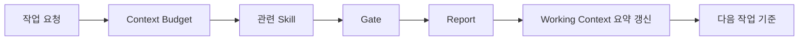

# 05. WORKING CONTEXT

> 한국어 별칭: 현재 작업 상태 요약  
> 목적: 장기 작업에서 현재 상태, 결정사항, 대기 항목, 다음 작업을 잃어버리지 않게 관리한다.

> **이 문서는 신규 프로젝트 부착용 빈 템플릿이다.** `GENERAL_HARNESS`를 만들고 다듬는 과정에서 쌓인 상태 이력·결정사항·작업 큐는 전부 `_WORKING_CONTEXT_HISTORY.md`("GENERAL_HARNESS 자체 개발 이력 완결편" 섹션)로 이관했다. 이 하네스를 실제 프로젝트에 부착하면, 아래 §1~§3의 빈 표를 그 프로젝트의 실제 상태로 채운다. §4~§10은 프로젝트와 무관하게 적용되는 운영 규칙이라 그대로 둔다.

---

## 1. 현재 프로젝트 상태

> 이 표는 하네스를 부착한 대상 프로젝트의 지금 시점 실제 값을 채운다. 프로젝트가 아직 없으면 빈 채로 둔다.

| 항목 | 상태 |
|---|---|
| 프로젝트명 | 챱챱 구독 서비스 디자인 프로토타입 |
| 기술 스택 | Vue 3 + Vite + JavaScript, Pinia, Axios, Lucide, AutoAnimate, PrimeVue 5(관리자 전용), Chart.js, Day.js |
| 하네스 부착일 | 2026-07-29 |
| 활성 스킬 | 13개(기본 구성, 프로젝트 전용 스킬 추가 시 갱신) |
| 활성 Gate | 7개(기본 구성) |
| 활성 Checklist | 6개(기본 구성) |
| 자동화 | 최소 검증 스크립트 7개(기본 구성) |
| 최신 Report 포인터 | `reports/_LATEST.md`가 가리키는 Report를 따르되, **이 프로젝트에 아직 project Report가 없으면 `_LATEST.md`는 여전히 하네스 자체의 마지막 유지보수 Report를 가리키고 있을 수 있다.** 그 경우 "프로젝트의 최신 상태"가 아니라 "하네스 자체의 최신 상태"이니 혼동하지 않는다. 이 프로젝트의 첫 작업을 마치고 첫 Report를 게시하는 순간부터 `_LATEST.md`는 project Report로 전환된다(부착 절차는 `09.AGENT_WORKFLOW.md §7-2` 참고) |

---

## 2. 핵심 결정사항

> 이 프로젝트에서 내린 구조적 결정을 아래 형식으로 기록한다. 아직 없으면 빈 채로 둔다.

| 번호 | 결정 | 이유 |
|---:|---|---|
| D-001 | 단건 마켓을 제거하고 정기 구독 서비스만 제공한다. | 메뉴는 플랜에 포함되는 선택 항목이며 단건 주문 흐름을 제공하지 않는다. |
| D-002 | 고객 UI는 직접 만든 컴포넌트, PrimeVue는 관리자 UI에만 사용한다. | 고객 화면의 브랜드 일관성과 관리자 표·차트 구현 편의성을 함께 확보한다. |
| D-003 | 프론트엔드 페이지를 `home`, `auth`, `menu`, `plans`, `subscription`, `account`, `admin` 서비스 폴더로 분리한다. | 백엔드 MSA 경계와 화면 소유권을 맞추고 서비스 전용 컴포넌트가 무분별하게 shared로 올라가는 것을 방지한다. |
| D-004 | 관리자 UI를 PrimeVue 5로 올리고 라이선스는 `VITE_PRIMEUI_LICENSE` 환경변수로 전달한다. | PrimeVue 5의 공식 오프라인 라이선스 검증 방식을 따르고 키를 소스 코드와 분리한다. |

---

## 3. 현재 작업 큐

> 이 프로젝트의 열린 작업을 우선순위와 함께 기록한다. 아직 없으면 빈 채로 둔다.

| 우선순위 | 작업 | 상태 |
|---|---|---|
| 높음 | PrimeUI Store에서 유효한 PrimeVue 5 라이선스 키 재발급 후 배지 제거 재검증 | 현재 키 서명 검증 실패 |
| 높음 | 백엔드 API 명세 수령 후 가격·배송·구독 데이터 연결 | 대기 |
| 높음 | 인증·권한·결제·환불 정책 확정과 API 연결 | 대기 |
| 높음 | 통합 Pinia store를 서비스별 store로 분리 | API 계약 후 진행 |
| 중간 | 실제 사진·회사·고객센터·약관 정보 연결 | 대기 |
| 중간 | 단위·컴포넌트·E2E 테스트 환경 추가 | 대기 |

## 2026-07-30 PrimeVue 5 전환 상태 요약

- 최근 완료: PrimeVue 5.0.0 업그레이드, 환경변수 기반 라이선스 연결, production build와 관리자 DataTable 렌더링 확인
- 남은 WARN/FAIL: 전달받은 키가 PrimeVue 5 오프라인 검증에서 `license signature is invalid`로 판정되어 개발 배지가 남아 있음. 자동화 테스트도 없음
- 다음 작업에 영향을 주는 결정: 검증을 우회하지 않고 PrimeUI Store에서 키를 재발급받아 `.env.local` 값만 교체한 뒤 브라우저 재검증한다.
- 더 이상 읽지 않아도 되는 오래된 맥락: PrimeVue 4 유지와 라이선스 불필요 판단은 사용자의 5버전 전환 요청으로 대체되었다.
- 다시 확인해야 하는 증거 Report: `reports/2026-07-30_chapchap-primevue5-upgrade_report.md`

---

## 4. Report 읽기 우선순위

Report가 여러 개 있으면 `reports/_LATEST.md`를 먼저 확인한다.
오래된 Report는 결정 근거와 변경 증거로만 사용하고, 다음 작업 판단은 `_LATEST.md`가 가리키는 최신 Report와 Working Context를 우선한다. **단, `reports/archive/HISTORY_DIGEST.md`의 PURGE_EVENT에 포함된 파일은 원본이 삭제된 상태다 — 그 경우 상세 근거는 digest 요약 한 줄로 대체되며 원본을 직접 열어 재현할 수 없다(외부 검수 M-07/X-07).**

| 상황 | 처리 |
|---|---|
| 최신 Report와 오래된 Report의 다음 작업이 다름 | 최신 Report와 Working Context를 우선 |
| 오래된 Report가 superseded로 표시됨 | 증거로만 보관하고 다음 작업 기준에서 제외 |
| 최신 Report에도 미해결 WARN/FAIL 존재 | 새 작업 전 재판정 |

---

## 5. Report와 Working Context 책임 분리

| 문서 | 역할 | 기록 수준 |
|---|---|---|
| `06.REPORT_TEMPLATE.md` | 작업 단위 증거 기록 | 변경 파일, 검증 명령, PASS/WARN/FAIL 근거, 미해결 항목을 상세 기록 |
| `05.WORKING_CONTEXT.md` | 현재 상태 요약 | 최신 결정, 열린 작업 큐, 반복되는 WARN/FAIL, 다음 작업만 요약 |

원칙:

- Report는 **작업별 상세 증거**다.
- Working Context는 **현재 상태와 다음 판단 기준**이다.
- Report 내용을 Working Context에 전부 복사하지 않는다.
- 반복되거나 다음 작업에 영향을 주는 핵심만 Working Context에 요약한다.

---

## 6. 실패/중단 후 재개 규칙

재개 절차의 공식 소유 기준은 `09.AGENT_WORKFLOW.md §7`이다. 이 문서는 현재 상태 요약 관점에서 아래 원칙만 유지한다.

- 작업 실패 또는 중단 후에는 새 작업을 바로 시작하지 않는다.
- 마지막 Report, Working Context, 실제 변경 파일, 남은 FAIL/WARN을 먼저 확인한다.
- 위험 작업에서 중단된 경우, 사용자 확인 또는 추가 근거 확보 전까지 이어서 수정하지 않는다.
- 완료 여부가 불명확한 변경은 완료로 표시하지 않는다.

---

## 7. 장기 요약 규칙

Report가 많아지면 Working Context에 아래 형식으로 요약한다.

```md
## YYYY-MM-DD 상태 요약

- 최근 완료:
- 남은 WARN/FAIL:
- 다음 작업에 영향을 주는 결정:
- 더 이상 읽지 않아도 되는 오래된 맥락:
- 다시 확인해야 하는 증거 Report:
```

오래된 세부 내용은 Report에 남기고, Working Context에는 다음 판단에 필요한 요약만 남긴다.

이 문서의 "상태 요약" 섹션은 **최신 1개 라운드만** 남긴다. 새 라운드가 끝나면, 그 이전까지 남아있던 상태 요약 섹션을 `_WORKING_CONTEXT_HISTORY.md`로 옮기고 이 문서에는 새 라운드 요약만 추가한다. 옮길 때 내용을 요약하지 않고 그대로 이관해 정보 손실이 없게 한다.

---

## 8. 변경 시 갱신 규칙

다음 일이 발생하면 이 문서를 갱신한다.

- 활성 스킬이 추가/삭제됨
- Gate 기준이 바뀜
- 체크리스트가 늘어남
- 자동화 스크립트가 추가됨
- 주요 결정이 바뀜
- 보류 항목이 실제 도입됨
- Critical/Major WARN/FAIL이 반복됨
- 실패/중단 후 재개 기준이 생김

---

## 9. 상태 기록 형식

```md
## YYYY-MM-DD 작업 기록

- 작업 요약:
- 변경 파일:
- 적용 Gate:
- PASS/WARN/FAIL:
- 미해결 항목:
- 다음 작업:
```

---

## 10. Working Context 연결 구조



요약: Report가 상세 증거를 남기고, Working Context는 그중 다음 판단에 필요한 상태만 요약한다.

---

`GENERAL_HARNESS` 자체를 만들고 다듬은 이력 전체는 `_WORKING_CONTEXT_HISTORY.md`("GENERAL_HARNESS 자체 개발 이력 완결편" 섹션)로 이관했다. 새 프로젝트에 이 하네스를 부착하면, 이 문서(§1~§3)는 그 프로젝트의 상태로 새로 채우고, 하네스 자체의 개발 결정이 왜 그렇게 됐는지 궁금하면 이력 파일과 `10.ADR.md`를 참고한다.
