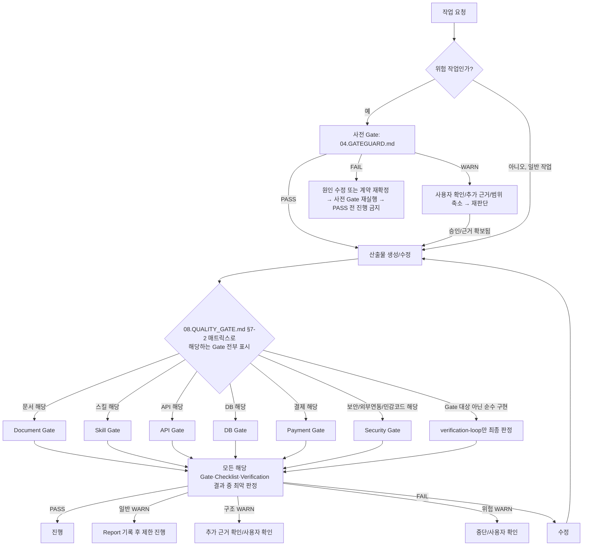

# 08. QUALITY GATE

> 한국어 별칭: 품질 통과 기준  
> 목적: 모든 산출물이 다음 단계로 넘어가기 전 통과해야 하는 공통 판정 기준을 정의한다.  

---

## 1. Quality Gate의 의미

Quality Gate는 “좋은 결과물을 만들어주는 도구”가 아니라, **나쁜 결과물이 다음 단계로 넘어가지 못하게 막는 문**이다.

---

## 2. 공통 판정

| 판정 | 의미 | 처리 | 해제 조건 |
|---|---|---|---|
| PASS | 기준 충족 | 다음 단계 진행 가능 | 해당 없음(이미 통과) |
| WARN | 일부 보완 필요 | 위험도에 따라 진행 또는 중단/확인 | 일반 WARN은 기록 후 진행 가능. 구조/위험 WARN은 `04.GATEGUARD.md §6-1`의 위험 유형별 표에 따라 사용자 승인 또는 정의된 근거 확보 후 진행 |
| FAIL | 기준 미달 | 수정 전 진행 금지 | **원인을 실제로 수정하거나, 안전한 범위로 작업 계약을 다시 확정한 뒤, 같은 Gate를 재실행해 PASS를 받아야 해제된다. 사용자 확인만으로는 FAIL을 PASS로 바꾸지 않는다.** |

FAIL과 위험 WARN은 해제 방식이 다르다. 위험 WARN은 사용자 승인이나 정의된 근거로 진행 여부를 결정할 수 있지만, FAIL은 산출물 자체에 결함이 있다는 뜻이라 승인이 아니라 수정과 재검증으로만 해제한다.

---

## 3. WARN 처리 분기

| WARN 유형 | 예시 | 처리 |
|---|---|---|
| 일반 WARN | 설명이 조금 짧음, 예시가 부족함 | Report에 기록 후 제한 진행 가능 |
| 구조 WARN | 문서 연결, 스킬 인계, 번호 체계가 일부 모호함 | 추가 근거 확인 후 진행 |
| 위험 WARN | 삭제, 대량 이동, DB, 결제, 인증, 권한, 외부 스크립트 | 사용자 확인 또는 추가 근거 전 진행 금지 |

---

## 4. Gate 분류

| Gate | 대상 | 파일 |
|---|---|---|
| Document Gate | 일반 문서, SRS, 설명서 | `gates/document-gate.md` |
| Skill Gate | `skills/*/SKILL.md` | `gates/skill-gate.md` |
| API Gate | API 명세, 서버 처리 설계 | `gates/api-gate.md` |
| DB Gate | ERD, DB 스키마, 인덱스 | `gates/db-gate.md` |
| Code Verification | 일반 구현 코드, 빌드/검사/테스트 결과 | `skills/verification-loop/SKILL.md` |
| Payment Gate | 결제 승인/실패/취소/웹훅 | `gates/payment-gate.md` |
| Security Gate | 인증, 권한, 민감정보 | `gates/security-gate.md` |

---

## 5. Gate와 Checklist의 관계

| 구분 | 역할 | 사용 시점 |
|---|---|---|
| Gate | PASS/WARN/FAIL 판정 기준 | 모든 산출물에 기본 적용 |
| Checklist | 사람이 확인해야 하는 세부 항목 | 산출물이 크거나, 제출/리뷰/위험 작업일 때 추가 적용 |
| Report | Gate와 Checklist 결과의 증거 기록 | 작업 후 또는 WARN/FAIL 발생 시 |

규칙:

- Gate는 필수다.
- Checklist는 모든 작업에 강제하지 않는다.
- 결제/보안/DB/API처럼 실패 비용이 큰 산출물은 Checklist 사용을 권장한다.
- Checklist 결과는 `06.REPORT_TEMPLATE.md`의 “Checklist 결과” 섹션에 옮긴다.

---

## 6. 사전 Gate와 사후 Gate

위험 작업은 Gate를 한 번만 적용하지 않는다.

| Gate 유형 | 적용 시점 | 판단 질문 |
|---|---|---|
| 사전 Gate | 수정/삭제/명령 실행 전 | 이 작업을 지금 진행해도 안전한가? |
| 사후 Gate | 산출물 생성/수정 후 | 이 산출물을 다음 단계로 넘겨도 되는가? |

위험 작업의 사전 Gate 결과에 따라 처리가 다르다. **WARN**이면 사용자 확인, 추가 근거 확보, 범위 축소 중 하나를 수행한 뒤 진행할 수 있다. **FAIL**이면 그중 아무것도 FAIL을 해제하지 못한다 — 원인을 수정하거나 안전한 범위로 작업 계약을 다시 확정한 뒤, 같은 사전 Gate를 재실행해 PASS를 받아야 한다(`08.QUALITY_GATE.md §2`의 FAIL 해제 조건과 동일).

## 7. 전체 흐름

이 흐름도는 사전 Gate 분기부터 사후 Gate 판정까지 전체 구간을 그린 것이다(위험 작업이면 `START`에서 바로 `PRE`로 간다. 일반 작업만 사전 Gate 없이 바로 산출물 생성으로 간다). **`M` 노드는 "하나만 고르는 분기"가 아니라 "해당하는 것을 전부 표시하는 판단"이다 — `§7-2` 매트릭스와 반드시 같은 결과를 내야 한다.**



요약: 위험 작업은 사전 Gate를 먼저 통과해야 산출물 생성 단계로 넘어간다. 산출물이 만들어진 뒤에는 유형별 Gate를 적용하고, WARN은 일반 WARN, 구조 WARN, 위험 WARN으로 나눠 처리한다.

---

## 7-1. Checklist 항목 집계 규칙

`checklists/*.md`의 각 항목은 `결과(PASS/FAIL/N/A)`와 `근거·미해결 항목` 두 열을 갖는다(외부 검수 M-13). 항목별 결과를 체크리스트 전체의 **Checklist 판정**으로 합산하는 규칙은 이 문서가 소유한다(외부 검수 m-01 — 이 절이 §7-2 전역 최종판정 도입 이전에 쓰여 "최종 판정"이라는 용어를 그대로 쓰고 있었다. 이 절이 다루는 건 Checklist 자체의 판정이지 산출물 전체의 최종 판정이 아니다).

- 항목 하나라도 FAIL이면, 그 항목이 해당 Checklist의 "FAIL 기준"에 명시된 필수 항목인 경우 전체 판정은 FAIL이다.
- 필수 항목이 아닌 항목의 FAIL은 WARN(일반/구조/위험 중 적용 기준에 따라 분류)으로 처리한다.
- N/A는 "확인하지 않음"이 아니라 "이 산출물에는 해당하지 않음"이며, 근거·미해결 항목 열에 왜 N/A인지 한 줄로 남긴다. 근거 없는 N/A는 미확인(FAIL 후보)으로 간주한다.
- 항목 전체가 PASS 또는 정당한 N/A일 때만 Checklist 전체가 PASS다.

---

## 7-2. 복합 Gate 누적과 최악 판정

산출물 하나가 여러 Gate에 동시에 해당할 수 있다. 이때 Gate를 하나만 골라 적용하지 않는다(외부 검수 C-03).

1. 산출물에 실제로 해당하는 Gate를 전부 선택한다. 하나만 고르지 않는다.
2. **아래 매트릭스가 결제·보안 복합 Gate 적용의 유일한 SoT다.** `07.SECURITY_BASELINE.md`, `skills/quality-gate/SKILL.md`, `skills/verification-loop/SKILL.md`, `skills/security-review/SKILL.md`는 이 표를 그대로 참조하며 각자 다시 정의하지 않는다(외부 검수 C-04).

| 산출물 | 누적 Gate |
|---|---|
| 결제 API 계약/구현 | API + Security + Payment |
| 결제 ERD/스키마 | DB + Security + Payment |
| 결제 정책/화면 문서(API·DB 아님) | Document + Security + Payment |
| **결제·환불·구독 결제 화면 설계** | UI/UX + Security + Payment |
| 로그인/토큰/권한 API(결제 아님) | API + Security |
| 로그인/토큰 관련 DB | DB + Security |
| **로그인/토큰/권한 화면 설계** | UI/UX + Security |
| 관리자 권한 API(화면 설계가 아닌 API 계약 자체) | API + Security |
| **관리자 권한 화면 설계** | UI/UX + Security |
| 개인정보 수정 API | API + Security |
| 개인정보 관련 DB/ERD | DB + Security |
| 개인정보 관련 문서(API·DB 아님) | Document + Security |
| **개인정보 조회·수정 화면 설계** | UI/UX + Security |
| 파일 업로드 API | API + Security |
| 외부 서비스(제3자 API 등) 연동이 있는 API(그 자체는 민감 기능이 아니어도) | API + Security(외부 응답 신뢰성 검증 때문에 — `gates/security-gate.md`의 "외부 요청" 필수 항목) |
| 일반 API(외부 연동 없음, 민감 기능 아님) | API |
| 일반 DB(민감 기능 아님) | DB |
| 일반 공개 문서 | Document |
| **일반 화면 설계(민감 기능 아님)** | UI/UX |
| **화면 설계이면서 API 계약까지 함께 정의하는 산출물** | UI/UX + API, 민감 기능이면 위 행들에 따라 + Security/Payment 추가 |
| 인증/권한/암호화/결제 계산처럼 보안·결제에 직접 관련된 순수 구현 코드(그 자체가 API/DB 계약은 아님) | Security(또는 결제 관련이면 + Payment) + `skills/verification-loop/SKILL.md`(빌드·테스트 실행). 이 조합의 최종 판정은 §7-2 4번의 최악 판정 규칙을 그대로 따른다 |
| 그 외 일반 구현 코드(신규 기능, 버그 수정 등 — 보안/결제와 무관하고 API/DB 계약 자체도 아닌 코드) | 해당하는 API/DB Gate(있으면) + `skills/verification-loop/SKILL.md`(빌드·테스트 실행) — Gate가 없는 순수 로직이면 verification-loop 결과가 곧 최종 판정 |

**UI/UX Gate와 Document Gate를 동시에 적용할 필요는 없다** — 화면 설계의 **내용 품질**(사용자 목표, 흐름, 상태, 반응형, 접근성, 구현 가능성)은 UI/UX Gate가 소유한다. 그 화면 설계 산출물이 일반 Markdown 문서로서의 구조·완결성까지 별도로 검사해야 할 특별한 이유가 있을 때만 Document Gate를 추가로 누적한다(외부 검수 반영 — 중복 적용을 기본값으로 삼지 않는다).

**Payment Gate는 결제·환불이 실제로 관련된 산출물에만 적용한다** — 로그인처럼 결제가 아닌 High 등급 보안 기능에는 Payment Gate를 적용하지 않는다(`07.SECURITY_BASELINE.md §2`가 과거 이 부분을 잘못 표기했던 것을 여기서 정정). API/DB/Document 중 어떤 Gate가 함께 붙는지는 산출물 자신의 유형(API 계약인지, DB 스키마인지, 순수 문서인지)에 따라 정해지며, "결제인지 아닌지"와는 별개의 축이다.

**실제 실행 코드가 있으면 위 표의 어떤 행이 적용되든 `skills/verification-loop/SKILL.md`(빌드·테스트 실행)를 항상 함께 누적한다** — 계약 자체(API 명세, DB 스키마)만 다루는 산출물이면 해당 없음(N/A)이지만, 그 계약을 실제로 구현한 코드가 있다면 Gate 판정만으로 끝내지 않는다(외부 검수 M-03/G-04 — 예전엔 이 규칙이 "Gate 대상 아닌 순수 구현" 행에만 있어서, 결제 API처럼 이미 Gate가 있는 구현은 Verification 없이도 통과할 수 있었다).

3. 각 Gate를 독립적으로 판정한다.
4. 여러 Gate 판정 중 **가장 심각한 것이 이 단계의 "Gate 집계 판정"이다**(FAIL > 위험 WARN > 구조 WARN > 일반 WARN > PASS). 이것과 아래 "전역 최종 판정"은 다른 것이다 — Gate 집계 판정은 Gate들끼리만 비교한 결과이고, 전역 최종 판정은 여기에 Verification·Checklist까지 더해 비교한 결과다(외부 검수 m-02).
5. Checklist PASS는 Gate의 WARN/FAIL을 낮추지 못한다 — Checklist는 증거 수집이지 Gate 판정을 무효화하는 절차가 아니다.
6. FAIL은 그 FAIL을 낸 Gate가 재검증 PASS를 받아야 해제된다(`08.QUALITY_GATE.md §2`와 동일 원칙).

**전역 최종 판정 공식(모든 산출물에 적용, 외부 검수 M-05/G-06):**

```text
최종 판정 = maxSeverity(
  skills/verification-loop/SKILL.md 결과(해당하면),
  적용된 Gate 전부의 판정,
  적용된 Checklist 전부의 판정
)
```

해당하지 않는 구성요소(예: 릴리즈가 아니라 Checklist 자체가 없는 경우)는 근거 있는 N/A로 제외한다. `checklists/release-checklist.md`, `checklists/srs-checklist.md`를 포함한 모든 Checklist의 "결과 요약"은 **그 Checklist 자체의 판정**이지, 전체 산출물의 최종 판정이 아니다 — Checklist가 PASS여도 같은 산출물의 Gate나 Verification이 WARN/FAIL이면 전체 최종 판정은 여전히 그 WARN/FAIL이다. 비릴리즈 구현(릴리즈 체크리스트를 안 쓰는 일반 작업)에서도 verification-loop가 FAIL을 냈으면, 관련 Gate가 전부 PASS라도 최종 판정은 FAIL이다 — verification-loop 결과가 조용히 사라지지 않는다.

`skills/quality-gate/SKILL.md §7`은 이 문서(`08.QUALITY_GATE.md`)의 §7-2 매트릭스를 그대로 참조하며 별도 표를 갖지 않는다(외부 검수 D-01, m-02 — 예전엔 존재하지 않는 표를 인용하는 죽은 참조가 있었다).

**릴리즈 최종 판정의 소유자는 이 문서(`08.QUALITY_GATE.md`)이며, 이 절의 규칙을 그대로 적용한다.** 릴리즈처럼 `verification-loop`의 검증 결과, 관련 Gate들의 판정, `checklists/release-checklist.md`의 결과가 모두 존재하는 경우도 다르지 않다 — 셋 중 가장 심각한 것이 최종 판정이다. `verification-loop`가 WARN을 냈는데 `release-checklist`가 PASS라고 해서 최종 판정이 PASS가 되지 않는다(그 반대도 마찬가지).

---

## 8. 자동화 대상과 수동 검수 대상

| 구분 | 자동화 적합 | 사람/AI 리뷰 적합 |
|---|---|---|
| 파일 존재 | 높음 | 낮음 |
| 필수 섹션 | 높음 | 중간 |
| 네이밍 규칙 | 높음 | 낮음 |
| 링크 깨짐 | 높음 | 낮음 |
| 설명 품질 | 낮음 | 높음 |
| 비즈니스 타당성 | 낮음 | 높음 |
| 보안 위협 시나리오 | 중간 | 높음 |
| 결제 상태 흐름 | 중간 | 높음 |
| 하네스 규칙 충돌 | 낮음 | 높음 |

---

## 9. 현재 자동화 범위

초기에는 다음 7개 스크립트를 사용한다. 이 중 `validate-package.mjs`는 사용자가 ZIP export를 명시적으로 요청한 경우에만 실행한다.

| 스크립트 | 역할 | PASS 의미 |
|---|---|---|
| `scripts/validate-harness.mjs` | 필수 파일/폴더 존재 검사 | 구조 필수 요소 존재 |
| `scripts/validate-skills.mjs` | 스킬 필수 섹션 검사 | 필수 섹션 존재 |
| `scripts/validate-docs.mjs` | 문서 필수 제목, 빈 파일, 기본 링크 형태 검사 | 기본 Markdown 구조 통과 |
| `scripts/validate-package.mjs` | 선택적 ZIP export의 이름·내부 구조를 **순수 Node(zlib) ZIP 파서로 직접 파싱**(단일 루트/경로탈출/exact 중복/대소문자 중복/필수파일/추출본과의 전체 파일명 parity/**파일별 SHA-256 내용 비교**) | ZIP export 요청 시에만 적용한다. 요청된 ZIP이 없거나 파싱할 수 없으면 FAIL이다. Git 공식 반영은 이 검증과 독립적이다. |
| `scripts/validate-no-personal-paths.mjs` | `07.SECURITY_BASELINE.md`의 개인 경로 노출 금지 규칙 검사(Unicode 이름 포함, 여러 드라이브·UNC·`/root/` 포함) | 개인 절대경로 미노출(단, 지원 패턴 밖의 특수 마운트 경로는 검사 대상 아님) |
| `scripts/validate-report-consistency.mjs` | `reports/_LATEST.md`/`05.WORKING_CONTEXT.md`/`02.SKILL_INDEX.md`의 현재 기준 일치(스킬 이름 집합까지 비교), `reports/archive/HISTORY_DIGEST.md` 색인 완전성 검사 | 최신성 동기화 통과 |
| `scripts/validate-references.mjs` | 문서 내부 경로·섹션(`파일.md §N`) 참조가 실제 파일/헤딩과 일치하는지 검사(`reports/`도 포함하되 archive 이동에 대한 폴백 적용) | 참조 무결성 통과(단, `_PENDING_IMPORT_LIST.md`/`_SOURCE_MAPPING.md`/`10.ADR.md`는 외부·역사 인용이 많아 검사 대상에서 제외, 소수의 알려진 예외는 스크립트 내 허용 목록 참고) |

---

## 10. 자동 검증 PASS의 한계

`scripts/*.mjs`의 PASS는 **구조 검증 통과**를 뜻한다.

자동 검증 PASS가 보장하지 않는 것:

- 문서의 의미 품질
- 우선순위 충돌 해결
- 보안 타당성
- 결제 비즈니스 로직 안전성
- 스킬별 Gate의 실제 판정력
- 사용자 요청과 Working Context의 충돌 처리

내용 품질은 관련 Gate와 Checklist, 필요 시 사람/AI 리뷰로 별도 확인한다.


### 10-1. 검증 스크립트 보증 범위

| 스크립트 | 보장하는 것 | 보장하지 않는 것 |
|---|---|---|
| `scripts/validate-harness.mjs` | 필수 파일/폴더 존재, 하네스 루트 탐색 가능 여부 | 문서 내용 품질, 운영 판단 타당성 |
| `scripts/validate-skills.mjs` | 필수 스킬 섹션, `Harness Control Rule` 최소 요건, 기본 Handoff 대상 존재 여부 | Handoff 문맥 적합성, 스킬별 절차 품질 전체 |
| `scripts/validate-docs.mjs` | Markdown 빈 파일, 최상위 제목, 빈 링크 같은 기본 구조 | 문서 의미, 보안/결제 안전성, 요구사항 품질 |
| `scripts/validate-package.mjs` | 사용자가 요청한 ZIP export의 이름과 실제 내부 구조(단일 루트/경로탈출/exact 중복/대소문자 중복/필수파일), 추출본과 ZIP의 전체 파일명 parity, **파일별 SHA-256 내용 비교** | 압축 내용의 의미 품질과 Git 공식 반영 여부. ZIP이 없거나 손상되면 export 요청은 FAIL이지만, ZIP 요청이 없는 Git 작업은 이 검증 대상이 아니다. |
| `scripts/validate-no-personal-paths.mjs` | macOS/Windows(여러 드라이브)/UNC/`/home/`/`/root/` 형태의 개인 경로, Unicode 이름 | 지원 패턴 목록 밖의 특수 마운트·컨테이너 경로, 스크립트 내 허용된 placeholder 이름으로 위장된 실제 개인 경로 |
| `scripts/validate-references.mjs` | 문서 내부 `.md`/`.mjs` 경로 참조, `파일.md §N` 섹션 참조가 실제 파일/헤딩과 일치하는지(archive 이동 폴백 포함) | `_PENDING_IMPORT_LIST.md`/`_SOURCE_MAPPING.md`/`10.ADR.md` 3개 파일은 **아예 검사 대상이 아니다** — 이 안의 참조(자기 자신의 현재 섹션 참조 포함)는 전혀 확인되지 않는다(외부 검수 M-12, 알려진 한계로 유지). 텍스트가 아닌 이미지·외부 URL 링크도 검사하지 않는다 |
| `scripts/validate-report-consistency.mjs` | `_LATEST.md` 대상 존재, 스킬 이름 집합·개수 일치, archive 색인 완전성 | Working Context 상태 요약 문장 자체의 사실 정확성(예: 프로즈로 서술된 최신 기준이 실제로 최신인지는 확인하지 않음) |
| `scripts/validate-no-secrets.mjs` | Git 추적 파일에 금지 파일 패턴(`.claude/`, zip, .env, 키 파일)과 알려진 비밀값 토큰 패턴(AWS/GitHub/Slack/sk-/Google/개인키 블록/JWT)이 없는지 | 목록 밖 형식의 토큰, 난독화된 비밀값, 이미 과거 커밋 이력에 들어간 비밀값(이력 정리는 별도 절차) |


---

## 11. FAIL 예시

| 상황 | 이유 |
|---|---|
| 스킬에 Trigger가 없음 | 언제 써야 하는지 알 수 없음 |
| API 명세에 실패 응답이 없음 | 프론트/백엔드 예외 흐름이 깨짐 |
| DB 테이블에 PK가 없음 | 데이터 식별이 불안정함 |
| 결제 금액을 서버에서 검증하지 않음 | 금액 변조 위험 |
| 보안 기능에 권한 검사가 없음 | 타 사용자 데이터 접근 가능 |
| 위험 작업 WARN을 사용자 확인 없이 진행 | 사고 가능성이 남음 |


## 12. 저비용 의미 검증 상태

자동화 후보는 구현 상태를 구분해 관리한다. 구현된 항목도 전체 의미 품질을 보장하지는 않는다.

| 항목 | 상태 | 비고 |
|---|---|---|
| `Harness Control Rule` 필수 검사 | 기초 구현 완료 | `scripts/validate-skills.mjs` |
| Handoff 대상 존재 여부 | 기초 구현 완료 | canonical 표기 `skills/{skill-name}/SKILL.md`와 `.md` 파일 대상 확인 |
| Handoff 문맥 적합성 | 후보 | 연결 순서가 실제 작업 흐름에 적절한지는 수동/Gate 검수 필요 |
| 체크리스트 위험 WARN 문구 검사 | 후보 | 결제/DB/릴리즈 체크리스트 변경이 반복될 때 자동화 검토 |
| 전역 중립 표현 검사 | 후보 | 특정 스택/프로젝트 단계 표현이 반복될 때 자동화 검토 |
| ADR 번호 중복 검사 | 후보 | ADR이 더 누적되면 자동화 검토 |
| 최신 Report/Working Context 동기화 검사 | 기초 구현 완료 | `scripts/validate-report-consistency.mjs` |
| 문서 내부 참조 경로 검사 | 기초 구현 완료 | `scripts/validate-references.mjs`(외부·역사 인용 문서는 제외) |
| H2 번호 중복 검사 | 기초 구현 완료 | `scripts/validate-docs.mjs` |
| 안정 패키지명 검사 | 기초 구현 완료 | `scripts/validate-package.mjs` |
| 개인 경로 노출 검사 | 기초 구현 완료 | `scripts/validate-no-personal-paths.mjs` |
| ZIP 내부 구조 검사(순수 Node 파서, 단일 루트/경로탈출/exact·대소문자 중복/필수파일/파일별 SHA-256) | 기초 구현 완료 | `scripts/validate-package.mjs` |
