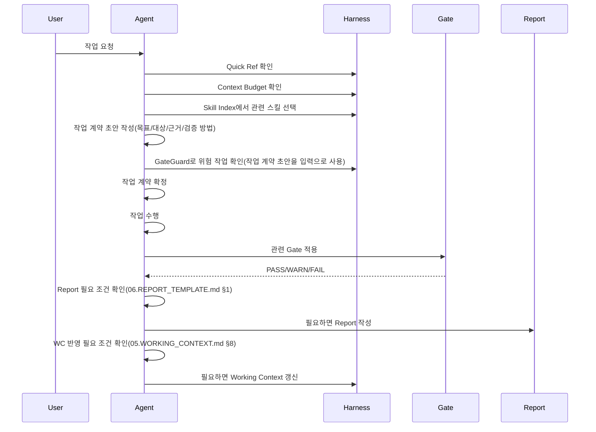

# 09. AGENT WORKFLOW

> 한국어 별칭: Agent 작업 절차  
> 목적: Claude Code, Codex, ChatGPT, CLI Agent가 이 하네스를 사용할 때의 기본 작업 절차를 정의한다.  

---

## 1. 기본 역할

| 역할 | 담당 |
|---|---|
| User | 목표, 제약, 우선순위 제시 |
| Planning Agent | 작업 범위, 읽을 문서, 적용 스킬 결정 |
| Build Agent | 문서/코드/구조 생성 또는 수정 |
| Review Agent | Gate와 Checklist 기준으로 검수 |
| Report Agent | 변경 내역, 검증 결과, 미해결 항목 기록 |

실제 사용 시 역할은 한 Agent가 모두 수행할 수 있다. 중요한 것은 **역할을 분리해서 사고하는 것**이다.

### 1-1. 혼합 운영 최소 역할 분기

Claude + Codex처럼 여러 Agent를 함께 사용할 때도 새 진입 문서를 만들지 않고 아래 최소 분기만 적용한다.

| 운영 형태 | 주 담당 | 먼저 확인할 것 | 넘겨줄 것 |
|---|---|---|---|
| 문서/SRS 판단 중심 | Claude형 문서 판단 Agent | `00.QUICK_REF.md`, 대상 문서, 필요 시 `gates/document-gate.md`·`checklists/srs-checklist.md` | 판단 근거, Source of Truth 우선순위, 사용자 확인 필요 항목 |
| 로컬 파일 수정/검증 중심 | Codex형 로컬 실행 Agent | 실제 파일 목록, 수정 대상, `00.QUICK_REF.md`, `04.GATEGUARD.md`, 관련 Skill/Gate | 변경 파일, 검증 명령, PASS/WARN/FAIL 결과 |
| 이어받기/복구 | 다음 실행 Agent | `05.WORKING_CONTEXT.md`의 Handoff Note, 없으면 `reports/_LATEST.md` | 완료로 추정하면 안 되는 항목, 남은 WARN/FAIL |

이 표는 역할 경계를 고정하기 위한 최소 규칙이다. 특정 도구명이 바뀌어도 “문서 판단 Agent”와 “로컬 실행 Agent”의 책임 분리는 유지한다.

이 표는 §1의 작업 단계별 역할과 다른 축(Agent 유형 기준)이며, §1을 대체하지 않는다. 대응 경향은 다음과 같다: Codex형 로컬 실행 Agent는 주로 Build/Review 단계를 맡고, Claude형 문서 판단 Agent는 주로 Planning/Report 단계를 맡는 경우가 많다. 다만 한 Agent가 여러 단계를 함께 수행할 수도 있으므로 이는 고정 규칙이 아니라 일반적인 경향이다.

---

## 2. 표준 작업 순서



요약: 요청을 받은 뒤 Quick Ref, Context, Skill을 확인하고 작업 계약 초안을 만든다. 이후 GateGuard로 위험도를 판정한 뒤 작업 계약을 확정하고, 작업한 뒤 Gate로 마무리한다. **Report와 Working Context 갱신은 모든 작업에서 무조건 실행되는 단계가 아니다** — Report 작성 여부는 `06.REPORT_TEMPLATE.md §1`, Working Context 갱신 여부는 `05.WORKING_CONTEXT.md §8`이 각각 조건을 소유한다. 이 문서는 그 판단을 "확인하는 단계가 있다"는 것만 요약한다. **S 작업(단순 질문, 오타 수정 등)도 같은 방식으로 예외가 있다** — `00.QUICK_REF.md §5`(언제 00 전체를 읽는가)의 표에 따라 충돌·위험 판단이 필요하지 않으면 Quick Ref 확인 단계를 생략할 수 있다.

---

## 3. 작업 전 규칙

작업 전 반드시 확인한다.

```txt
1. `00.QUICK_REF.md`의 충돌 우선순위와 위험 작업 기준을 확인했는가?
2. 작업 범위가 명확한가?
3. 적용해야 할 스킬이 무엇인가?
4. 읽어야 할 문서와 읽지 않아도 되는 문서가 무엇인가?
5. 위험 작업인가?
6. 어떤 Gate로 검증할 것인가?
7. 위험 작업 WARN일 때 중단/확인 기준이 있는가?
```

---

## 4. 작업 계약 최소 형식

작업 시작 전 내부적으로 아래 계약을 만든다.

| 항목 | 내용 |
|---|---|
| 목표 | 이번 작업의 완료 기준 |
| 수정 대상 | 실제로 바꿀 파일/폴더 |
| 제외 대상 | 건드리지 않을 범위 |
| 근거 | 판단에 사용한 문서/파일/대화 내용 |
| 적용 스킬/Gate | 사용할 스킬과 검증 기준 |
| 위험도 | 일반 / 구조 / DB / 보안 / 결제 / 파일 손상 가능 / 외부 실행 / 환경 변경(비파괴적) |
| 검증 방법 | 실행할 스크립트, 수동 확인, Checklist |

작업 계약은 초안 작성 → GateGuard 위험 판정 → 계약 확정 순서로 다룬다.

대규모 수정, 삭제, 결제/보안/DB 변경은 작업 계약이 불명확하면 진행하지 않는다.

---

## 5. 작업 중 규칙

| 규칙 | 설명 |
|---|---|
| 범위 이탈 금지 | 요청하지 않은 대규모 구조 변경을 하지 않음 |
| 근거 없는 생성 금지 | 필요한 근거가 없으면 대기 목록으로 남김 |
| 과도한 자동화 금지 | 초기 단계에서는 수동 실행형 스크립트 우선 |
| 보안/결제 가볍게 처리 금지 | 별도 Gate 적용 |
| 변경 이유 기록 | 나중에 추적 가능해야 함 |
| 스킬 상위 규칙 준수 | 스킬이 하네스 규칙과 충돌하면 상위 규칙을 따름 |

---

## 6. 파일 수정 안전 규칙

| 단계 | 규칙 |
|---|---|
| 1 | 수정 전 대상 파일을 확인한다. |
| 2 | 사용자 요청 범위 밖의 파일은 수정하지 않는다. |
| 3 | 삭제·대량 이동·덮어쓰기는 `04.GATEGUARD.md §6-1`의 "파일 손상 가능 작업"에 해당하며 **항상 현재 사용자의 실시간 확인이 필요하고 과거 근거로 대체할 수 없다.** 단일 파일의 작은 구조적 수정(예: 문서 1개의 섹션 번호 조정)처럼 "대량"이 아닌 이동/변경은 §6-1의 "구조 작업"에 해당해 사용자 확인 또는 유효한 근거로 진행할 수 있다. |
| 4 | 기존 사용자 변경을 덮어쓸 가능성이 있으면 중단하고 확인한다. |
| 5 | 수정 후 변경 요약 또는 diff 관점으로 검토한다. |
| 6 | 검증 결과와 미해결 항목을 남긴다. 정식 Report 파일 생성 여부는 `06.REPORT_TEMPLATE.md §1`의 조건에 따른다(이 표는 `04.GATEGUARD.md §9`와 같은 목적의 요약이며, 상세 조건의 소유 문서는 `04.GATEGUARD.md`다). |

---

## 7. 실패/중단 후 재개 규칙

이 절차가 재개 규칙의 소유 기준이다. `05.WORKING_CONTEXT.md §6`은 요약 참조이다.

작업이 실패하거나 중단된 뒤 재개할 때는 아래 순서를 따른다.

```txt
1. 사용자의 최신 요청 확인
2. 마지막 Report 확인
3. Working Context 확인
4. 실제 변경 파일 상태 확인
5. 실패한 검증 명령 또는 실패 사유 확인
6. 남은 WARN/FAIL 재판정
7. 완료 여부가 불명확한 항목은 완료 처리 금지
```

위험 작업이 WARN으로 중단된 경우, 사용자 확인 또는 추가 근거 확보 전까지 이어서 수정하지 않는다.

### 7-1. Handoff Note

토큰/세션 한계로 작업을 끝내지 못하고 다음 세션 또는 다른 Agent가 이어받아야 할 때는 아래 최소 형식으로 Handoff Note를 남긴다. Handoff Note는 완료 보고서가 아니라 이어받기용 현재 상태 기록이다.

```md
## Handoff Note

현재 목표:
현재까지 한 작업:
읽은 문서:
다음에 먼저 읽을 문서:
수정한 파일:
수정하지 말아야 할 파일:
남은 작업:
멈춘 이유:
적용해야 할 Gate/Checklist:
완료로 추정하면 안 되는 항목:
Report 트랜잭션 진행 단계(06.REPORT_TEMPLATE.md §8-2 기준, 몇 번째 단계까지 완료했는지):
```

Handoff Note는 우선 `05.WORKING_CONTEXT.md`에 최신 상태 요약으로 남긴다. 작업 단위 증거가 필요하면 해당 작업의 `06.REPORT_TEMPLATE.md` 리포트 하단에도 같은 Handoff Note를 남긴다. 다음 세션은 `05.WORKING_CONTEXT.md`의 Handoff Note를 먼저 확인하고, 없으면 `reports/_LATEST.md`가 가리키는 최신 Report를 확인한 뒤 이 문서 §7의 재개 절차를 따른다.

### 7-1a. 대화 메모리는 보조 수단이다

일부 실행 도구는 대화 기록 기반의 자체 메모리 기능을 가질 수 있다. 이런 대화 메모리는 특정 도구에만 있고 다른 실행 도구는 접근할 수 없으므로, 프로젝트 핵심 사실(결정사항, 위험 판정, 완료 여부)을 대화 메모리에만 남기지 않는다. 항상 Report, Working Context, 또는 Memory 같은 파일에 남기고, 대화 메모리는 그 파일을 더 빨리 떠올리는 보조 수단으로만 취급한다.

"완료 여부"(무엇을 고쳤는지, 왜 그렇게 결정했는지, 어떤 검증을 했는지)는 Report/ADR/`_WORKING_CONTEXT_HISTORY.md`에 파일로 남기는 핵심 사실이다. 정확한 실행 수치처럼 다시 실행해 재현 가능한 값은 전달 메시지에 요약할 수 있으나, Git 커밋·Report·ADR을 대체하지 않는다.

### 7-2. 신규 프로젝트 부착 시 Working Context 초기화와 `_LATEST.md` 전환

**배포 모델: Git 저장소 기반 템플릿 관리(사용자 확인 완료).** `GENERAL_HARNESS`는 프로젝트끼리 실시간으로 공유하거나 동기화하는 구조가 아니라, 각 프로젝트가 원본 저장소의 특정 커밋을 기반으로 필요한 문서를 자기 저장소에서 관리하는 구조다. 구체적으로:

- 원본 하네스의 기준은 Git 저장소와 그 커밋이다. ZIP은 기본 배포물이 아니다.
- 프로젝트에 부착할 때는 원본의 선택한 커밋을 복사·서브트리·수동 반영 등 프로젝트에 맞는 Git 방식으로 가져오고, 기준 커밋을 기록한다.
- 하네스 자체(스킬, Gate, 규칙)에 개선이 생겨도 이미 부착된 프로젝트 사본에 자동으로 반영되지 않는다. 그 프로젝트에서 필요하면 그 시점에 수동으로 반영 여부를 판단한다.
- 다른 프로젝트를 새로 시작할 때는 이미 부착된 프로젝트 사본이 아니라 원본 저장소의 공식 반영된 `main` 커밋을 기준으로 시작한다.

`GENERAL_HARNESS`를 새 프로젝트에 부착할 때는 `05.WORKING_CONTEXT.md`(이미 빈 템플릿)와 `reports/_LATEST.md`의 상태를 함께 초기화한다. 하나만 바꾸고 다른 하나를 그대로 두면 "프로젝트 상태"와 "하네스 자체 상태"가 뒤섞인다(외부 검수 M-01/X-05).

| 단계 | 처리 |
|---|---|
| 1 | `05.WORKING_CONTEXT.md §1~§3`을 대상 프로젝트의 실제 값(프로젝트명, 기술 스택, 부착일 등)으로 채운다. |
| 2 | 이 시점에는 `reports/_LATEST.md`가 아직 하네스 자체의 마지막 유지보수 Report를 가리키고 있다는 것을 인지한다. 이것을 프로젝트의 "현재 상태"로 착각하지 않는다. |
| 3 | 이 프로젝트에서 첫 작업을 하고 `06.REPORT_TEMPLATE.md §8-2` 절차에 따라 첫 project Report를 게시하면, 그 순간 `reports/_LATEST.md`가 이 project Report로 전환된다. 그 전까지는 project Report가 "아직 없음" 상태다. |
| 4 | 하네스 자체 변경 이력과 프로젝트 작업 큐를 같은 섹션에 섞지 않는다. 하네스 자체 이력이 궁금하면 `_WORKING_CONTEXT_HISTORY.md`, `reports/archive/`, `10.ADR.md`를 본다. |
| 5 | 프로젝트 부착 중 구조 변경이 필요하면 `04.GATEGUARD.md`의 구조 작업 WARN 기준을 따른다. |

과거 Report와 ADR은 기본적으로 삭제하지 않고 증거로 보존한다. 사용자가 명시적으로 삭제를 요청하면 `06.REPORT_TEMPLATE.md §8`의 절차(요약 선행 보존 + 삭제 이벤트 기록)를 따른다.

---

## 8. 작업 후 규칙

작업 후에는 다음을 남긴다.

- 생성/수정한 파일 목록
- 가져온 근거 또는 반입 이유
- PASS/WARN/FAIL 결과
- 사용한 Checklist 결과
- 아직 만들지 않은 항목 목록
- Working Context 반영 필요 여부
- 다음 작업 제안

Report/Working Context/archive/색인 갱신을 포함한 전체 완료 조건은 `06.REPORT_TEMPLATE.md`가 소유한다. 이 절은 요약이며, 실제 순서와 "완료"의 정의는 그 문서를 따른다.

---

## 9. Agent 실패 패턴

| 실패 패턴 | 방지 방법 |
|---|---|
| 전체를 한 번에 다 만들기 | A/B/C/D/X 등급으로 나눔 |
| 비슷한 스킬 중복 생성 | `skills/skill-scout` 먼저 사용 |
| 최신 상태를 잊음 | `05.WORKING_CONTEXT.md` 갱신 |
| 결과만 만들고 검수 증거 없음 | `06.REPORT_TEMPLATE.md` 사용 |
| 자동화 과잉 | Hook보다 수동 실행 스크립트 우선 |
| 위험 WARN을 진행 가능으로 오해 | `04.GATEGUARD.md`의 위험 작업 WARN 중단 규칙 적용 |
| 스킬을 상위 규칙처럼 사용 | `00.HARNESS_RULES.md` 우선순위 적용 |
| 검증 없이 구현 완료로 보고 | `skills/verification-loop/SKILL.md`로 빌드/검사/테스트/명세 일치 확인 |
| 같은 실패를 원인 분석 없이 반복 시도 | `skills/agent-recovery/SKILL.md`로 캡처 → 분류 → 최소 조치 순서 적용 |
