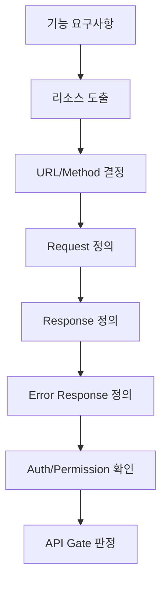

# API Gate

> 대상: API 명세, 서버 처리 설계, 프론트-백엔드 연결 문서

## 1. 필수 항목

| 항목 | 설명 |
|---|---|
| Method | GET/POST/PUT/PATCH/DELETE 중 선택 이유가 있어야 함 |
| URL | 리소스 중심으로 명확해야 함 |
| Request | Path, Query, Body 구분이 있어야 함 |
| Response | 성공 응답 구조가 있어야 함 |
| Error Response | 실패 응답 구조가 있어야 함(필수). 표준화된 오류 코드/메시지 형식은 권장이며, 형식이 없다고 FAIL은 아니지만 WARN 대상이다 |
| Auth | 인증 필요 여부가 있어야 함 |
| Permission | 현재 사용자가 해당 리소스에 접근 가능한지 기준이 있어야 함 |
| 계약 상태 | 명세가 `Candidate`(초안), `Confirmed`(확정), `Deprecated`(폐기/대체) 중 어디에 해당하는지 표시되어야 함 |

### 1-1. API 계약 상태 우선순위

| 상태 | 의미 | 변경 기준 |
|---|---|---|
| `Candidate` | 구현에 아직 쓰이지 않은 초안 | 자유롭게 수정 가능 |
| `Confirmed` | 프론트/백엔드 구현 또는 테스트 기준으로 쓰이는 확정 계약 | 변경 전 영향 범위와 사용자 확인 필요 여부를 판단 |
| `Deprecated` | 더 이상 새 구현 기준으로 쓰지 않는 폐기/대체 계약 | 현재 구현 기준으로 사용 금지, 대체 계약을 함께 표시 |

상태 표시가 없더라도 이미 코드, 테스트, 화면, 서버 구현에서 사용 중인 흔적이 있으면 즉시 `Candidate`로 간주하지 않는다. 이 경우 `Confirmed` 여부를 먼저 확인하고, 불명확하면 `04.GATEGUARD.md`의 구조 작업 WARN 기준을 적용한다.

## 2. PASS/WARN/FAIL

| 판정 | 기준 |
|---|---|
| PASS | Method 선택 이유, URL, Request, Response, Error Response, **인증(Auth) 여부**, **권한(Permission) 기준**이 전부 정의되고, 계약 상태(`Candidate`/`Confirmed`/`Deprecated`)가 명시됨 |
| WARN | 위 필수 항목은 있으나 계약 상태 표시가 없거나 실패 응답에 표준화된 오류 코드/메시지 형식이 없음(§1-1의 "이미 구현에 쓰인 흔적" 예외에도 해당하지 않는 경우). (인증·권한 관련이면 아래 위험 WARN 처리 섹션 참고) |
| FAIL | Method 선택 이유가 없거나, URL/Request/Response/Error Response/인증/권한 기준 중 하나라도 없음. 또는 계약 상태가 `Confirmed`인데 변경 전 영향 범위·사용자 확인 없이 수정됨 |

## 3. API 설계 흐름

요약: 요구사항에서 리소스를 도출하고, URL/Method, Request, Response, Error Response, Auth/Permission 순서로 검수한다.

---

## 위험 WARN 처리

위험 WARN 처리 → `08.QUALITY_GATE.md §3`, `04.GATEGUARD.md` 기준을 따른다.
