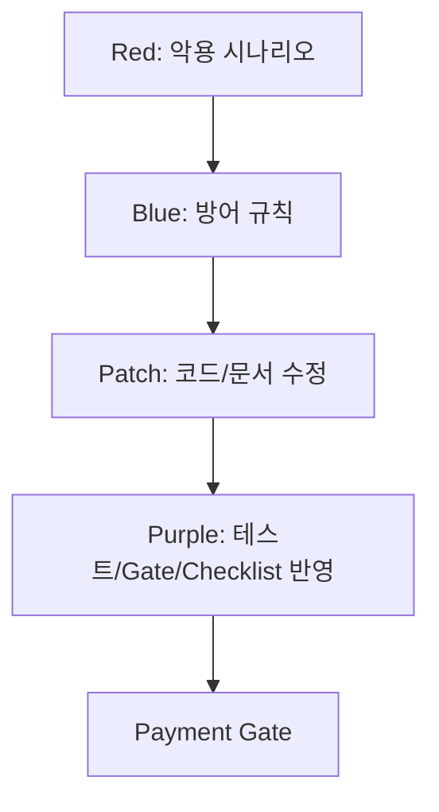

# Payment Gate

> 대상: 결제 요청, 결제 승인, 결제 실패, 취소/환불, 웹훅, 주문 상태 변경

## 1. 결제 Gate 핵심 원칙

결제는 일반 CRUD가 아니라 작은 금융 흐름이다. 정상 성공보다 **비정상 흐름에서 돈과 상태가 꼬이지 않는 것**이 더 중요하다.

## 2. 필수 검증 항목

| 항목 | 설명 |
|---|---|
| 서버 금액 검증 | 클라이언트 amount를 신뢰하지 않고 DB 주문 금액과 비교 |
| 주문 소유자 검증 | orderId가 현재 사용자/예약과 연결되는지 확인 |
| 중복 승인 방지 | 같은 paymentKey/orderId 중복 처리 방지 |
| 상태 전이 제한 | PENDING → PAID → CANCELED 등 허용 흐름만 허용 |
| 실패 처리 | 결제 실패 시 주문 상태가 PAID가 되지 않음 |
| 웹훅 검증 | 위조/중복/지연 웹훅에 대한 정책 존재 |
| 로그 기록 | 결제 성공/실패/취소 주요 이벤트 기록 |
| 환불 상태 전이 | 전액/부분 환불 요청이 이미 취소된 결제, 초과 금액 환불을 막는 상태 전이 규칙이 있음 |
| 환불 멱등성 | 같은 환불 요청을 중복 호출해도 중복 환불되지 않음 |
| 환불 보상 처리 | 외부 PG 환불은 성공했는데 내부 DB 갱신이 실패하는 경우의 보상/재시도 정책이 있음 |

## 3. Red/Blue/Purple 구조

## 4. PASS/WARN/FAIL

| 판정 | 기준 |
|---|---|
| PASS | 금액/권한/중복/상태/실패 흐름과 **로그 기록**이 모두 정의되고, 웹훅을 사용하는 흐름이면 위조/중복/지연에 대한 검증 정책이 있으며, 환불을 지원하면 환불 상태 전이·멱등성·보상 처리가 정의됨 |
| WARN | 결제 핵심 흐름은 있으나, 웹훅 검증 정책이 있긴 해도 위조·중복·지연 중 일부만 다루거나 로그 기록이 일부 이벤트만 남는 등 기준이 부족함(웹훅 검증 자체가 없거나 로그가 전혀 없으면 WARN이 아니라 FAIL). 환불을 지원하는데 멱등성이나 보상 처리 중 일부만 있는 경우도 WARN |
| FAIL | 클라이언트 금액 신뢰, 권한 누락, 중복 승인 가능, 실패 상태 꼬임, **로그 기록이 전혀 없음**, 웹훅을 사용하면서 검증 정책이 전혀 없음, 또는 환불을 지원하는데 환불 상태 전이·멱등성 기준이 전혀 없음(환불 미지원은 N/A) |

"웹훅 검증이 부족하다"(WARN)와 "웹훅 검증이 없다"(FAIL)는 다르다. 위조/중복/지연 중 하나라도 다루는 정책이 있으면 WARN, 아무 정책도 없으면 FAIL이다. 웹훅을 사용하지 않는 흐름은 이 항목을 N/A로 표시한다.

## 5. FAIL 예시

- 프론트에서 보낸 금액으로만 결제 승인
- 다른 사람 orderId로 결제 승인 가능
- 결제 승인 API를 두 번 호출해도 중복 처리됨
- 결제 실패 후 주문 상태가 확정됨
- 웹훅 검증 없이 결제 완료 처리됨

요약: Red Team 시나리오를 Blue Team 방어 규칙으로 바꾸고, Patch와 Purple Team 반영을 통해 Payment Gate에 고정한다.

---

## 위험 WARN 처리

위험 WARN 처리 → `08.QUALITY_GATE.md §3`, `04.GATEGUARD.md` 기준을 따른다.
