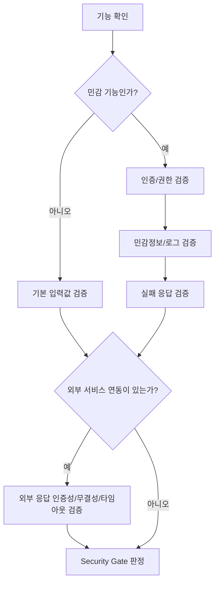

# Security Gate

> 대상: 인증, 권한, JWT, 관리자 API, 개인정보, 외부 API, 결제 주변 기능

## 1. 필수 검수 항목

| 항목 | 설명 |
|---|---|
| 인증 | 로그인 필요한 API인지 명확함 |
| 권한 | 현재 사용자가 해당 리소스에 접근 가능한지 검증함 |
| 입력값 검증 | 서버에서 Request를 검증함 |
| 민감정보 | 비밀번호, 토큰, 키가 노출되지 않음 |
| 로그 | 민감정보가 로그에 남지 않음 |
| 외부 요청 | 외부 API 응답을 무조건 신뢰하지 않음 |
| 실패 처리 | 권한 없음/인증 실패/검증 실패 응답이 있음 |

## 2. PASS/WARN/FAIL

| 판정 | 기준 |
|---|---|
| PASS | 인증/권한/입력값/민감정보/로그/외부 요청 신뢰/실패 처리 기준이 모두 충족됨(외부 연동이 없으면 그 항목은 N/A) |
| WARN | 직접 위험은 낮지만 일부 정책이 문서화되지 않음. 외부 연동이 있으면 인증성/무결성/타임아웃/실패 정책 중 일부만 정의된 경우도 여기(인증·권한·민감정보 관련이면 아래 위험 WARN 처리 섹션 참고) |
| FAIL | 권한 검사 없음, 비밀값 노출, 결제 금액 신뢰, 민감정보 로그 출력, 또는 외부 API 응답을 사용하는데 인증성·무결성 검증이나 타임아웃·실패 시 처리 정책이 전혀 없음(외부 연동이 없으면 N/A) |

## 3. 보안 검수 흐름

요약: 기능이 민감한지 판단한다. 민감하지 않아도 기본 입력값 검증을 거친 뒤 **외부 연동 여부는 민감도와 무관하게 항상 확인한다**(외부 검수 M-03/X-05 — 예전엔 비민감 경로가 이 확인 자체를 건너뛰어, 민감하지 않지만 외부 API를 호출하는 기능의 외부 응답 검증이 누락될 수 있었다). 민감하면 추가로 인증/권한/민감정보/로그/실패 응답을 검수한다.

---

## 위험 WARN 처리

위험 WARN 처리 → `08.QUALITY_GATE.md §3`, `04.GATEGUARD.md` 기준을 따른다.
