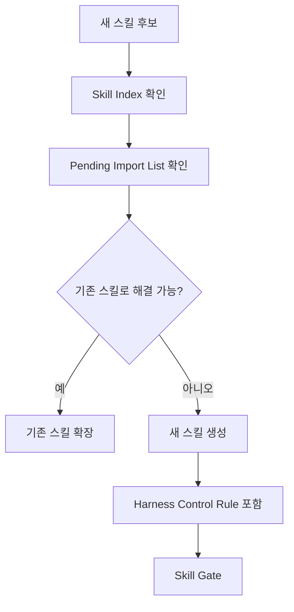

# Skill Gate

> 대상: `skills/*/SKILL.md`
> v0.2.1 보강: `Harness Control Rule`을 필수 섹션으로 승격하고, 스킬별 Quality Gate의 실질성을 확인한다.

## 1. 필수 섹션

| 섹션 | 필수 여부 | 판정 기준 |
|---|---|---|
| Harness Control Rule | 필수 | 스킬이 하네스 하위 모듈임을 명시하고, 상위 규칙 충돌 시 스킬 실행을 중단해야 함 |
| Trigger | 필수 | 스킬이 발동되는 상황이 구체적이어야 함 |
| Do Not Trigger | 필수 | 스킬 남용을 막는 비발동 조건이 있어야 함 |
| Required Inputs | 필수 | 작업 전 필요한 입력물이 명확해야 함 |
| Procedure | 필수 | 실행 절차가 순서대로 정리되어야 함 |
| Quality Gate | 필수 | 해당 스킬 작업에 맞는 PASS/WARN/FAIL 기준이 있어야 함 |
| Output Format | 권장 | 산출물 형식이 있으면 재사용성이 좋아짐 |
| Handoff | 필수 | 다음에 연결할 문서, Gate, Checklist, Report가 명확해야 함 |
| Anti-Patterns | 권장 | 흔한 실패 패턴을 막는 기준이 있어야 함 |

## 2. PASS/WARN/FAIL

| 판정 | 기준 |
|---|---|
| PASS | 필수 섹션이 모두 있고, `Harness Control Rule`, Trigger/Do Not Trigger, 작업별 Quality Gate, Handoff가 구체적으로 작성됨 |
| WARN | 필수 섹션은 있으나 Quality Gate가 일반 문구에 가깝거나, Handoff/Anti-Patterns가 약함 |
| FAIL | `Harness Control Rule`, Trigger, `Do Not Trigger`, `Required Inputs`, Procedure, Quality Gate, Handoff 중 하나 이상이 없거나, 스킬이 하네스 상위 규칙과 충돌함(`scripts/validate-skills.mjs`가 검사하는 필수 섹션과 동일한 기준) |

## 3. 작업별 Quality Gate 확인

스킬의 Quality Gate는 공통 문구 복붙만으로 통과하지 않는다.

| 확인 항목 | 기준 |
|---|---|
| 작업 특화성 | API, Git, 보안, 터미널 등 스킬 성격에 맞는 판정 기준이 있는가? |
| 위험 WARN 처리 | 위험 작업 WARN을 스킬 단독으로 진행하지 않도록 막는가? |
| 검증 가능성 | PASS/WARN/FAIL을 실제 산출물이나 입력물로 판단할 수 있는가? |
| 하위/상위 관계 | 상위 하네스와 충돌하면 스킬을 중단한다고 명시하는가? |

## 4. Handoff 표기 규칙

Handoff 표기 방식의 원본 기준은 `01.SKILL_TEMPLATE.md §7`이다.

Skill Gate에서는 아래 최소 기준만 확인한다.

| 대상 | 필수 확인 |
|---|---|
| 스킬 | `skills/{skill-name}/SKILL.md` 형식이며 실제 파일이 존재해야 함 |
| Gate/Checklist/Report/Working Context | 실제 파일 경로를 코드 span으로 표기해야 함 |

Handoff 대상 스킬은 반드시 `skills/{skill-name}/SKILL.md` 형식으로 표기한다. Bare skill name 표기, 예를 들어 `quality-gate`, `report-template`은 허용하지 않는다.

## 5. 중복 검사

새 스킬은 `02.SKILL_INDEX.md`와 `_PENDING_IMPORT_LIST.md`를 함께 확인한다.

요약: 새 스킬은 기존 목록과 보류 목록을 비교한 뒤, `Harness Control Rule`과 작업별 Gate를 포함해야 Skill Gate를 통과한다.
