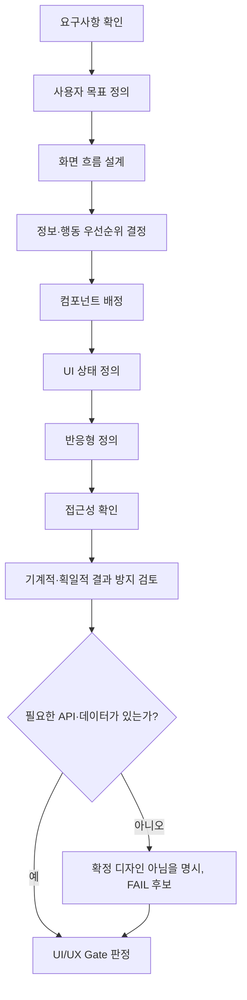

# UI/UX Gate

> 대상: 화면 설계 문서, 화면 흐름, 프론트엔드 인계 자료

## 1. 필수 항목

| 항목 | 설명 |
|---|---|
| 요구사항 연결 | 화면 요소가 요구사항 또는 명시된 설계 제안과 연결되어야 함 |
| 사용자 목표 | 대상 사용자와 이 화면의 완료 조건이 명확해야 함 |
| 화면 흐름 | 정상/취소/오류/재시도 경로가 있어야 함 |
| 정보 구조 | 정보와 행동(버튼 등)의 우선순위가 명확해야 함 |
| 컴포넌트 선택 근거 | 공통/Stack Profile 담당/커스텀 컴포넌트 중 어느 것을 쓸지와 그 이유가 있어야 함 |
| UI 상태 | Loading, Empty, Error, Disabled 등 필수 상태가 정의되어야 함 |
| 반응형 | Desktop/Tablet/Mobile 전환 방식이 정의되어야 함 |
| 접근성 | 키보드 조작, 포커스 순서, 레이블, 오류 안내, 색상 외 정보 전달 방식이 있어야 함 |
| 구현 가능성 | 필요한 API·데이터·권한 조건이 실제로 존재해야 함 |
| 인계 가능성 | 프론트엔드가 핵심 동작을 추측하지 않고 구현할 수 있는 수준이어야 함 |

## 1-1. 권장 항목(필수 아님, 없어도 PASS를 막지 않지만 완전히 없으면 WARN 대상)

| 항목 | 설명 |
|---|---|
| 브랜드·디자인 토큰 일관성 | 기존 토큰과 일치하면 좋지만, 새 화면 설계 자체를 막을 필수 조건은 아님 |
| Stack Profile 세부 준수 | 프로젝트에 Stack Profile이 활성화된 경우에만 해당(외부 검수 반영 — Stack Profile이 없는 프로젝트는 N/A) |

## 1-2. 기계적·획일적 결과 방지 검토

이 검토의 목적은 특정 미감이나 비대칭을 강제하는 것이 아니라, 화면 목적과 무관한 반복·장식·문구를 찾아내는 것이다. 결과와 선택 근거를 화면 설계 문서에 남긴다.

| 확인 항목 | PASS 기준 |
|---|---|
| 토큰과 표면 규칙 | 기존 토큰이 있으면 색상·타이포그래피·간격·모서리·그림자·아이콘 스타일을 일관되게 사용하고, 예외에는 이유가 있음 |
| 시각적 계층 | 주된 정보와 Primary Action이 보조 정보·장식보다 명확히 우선함 |
| 반복과 리듬 | 동일 카드·여백·섹션의 반복이 콘텐츠 구조를 설명하며, 의미 없는 균일 반복이 아님 |
| 장식 절제 | 그라디언트·글로우·강한 그림자·움직임은 정보 전달 또는 상호작용 목적이 있을 때만 사용함 |
| 콘텐츠 현실성 | 화면 문구가 실제 사용자 행동·상태·결과를 설명하며, 근거 없는 추상적 홍보 문구에 의존하지 않음 |
| 선택 근거 | 위 항목에서 의도적으로 다르게 선택한 부분은 화면 목적과 연결해 설명함 |

## 2. PASS/WARN/FAIL

| 판정 | 기준 |
|---|---|
| PASS | §1의 10개 필수 항목과 §1-2의 검토 기록이 모두 충족됨 |
| WARN | 필수 항목은 있으나 §1-1의 권장 항목이 부족하거나, §1-2의 검토 기록 또는 보완 조치가 일부 빠졌거나, 일부 화면 상태·반응형 설명이 약함(핵심 동작 판단에는 지장 없음). (개인정보·권한·결제 관련 화면이면 아래 위험 WARN 처리 섹션 참고) |
| FAIL | 화면 목적 또는 핵심 행동을 판단할 수 없음, 필요한 API·데이터가 없는데 확정 디자인으로 처리함, 로딩/오류 상태가 전혀 없음, 모바일에서 핵심 기능을 수행할 수 없음, 접근성 문제로 키보드 사용자가 핵심 기능을 수행할 수 없음, 시각적 계층 문제로 Primary Action을 식별할 수 없음, 또는 Stack Profile이 활성화되어 있는데 그 스택의 금지 규칙(§4)을 위반함 |

## 3. UI/UX 검수 흐름

요약: 요구사항에서 사용자 목표를 정의하고, 화면 흐름·정보구조·컴포넌트·상태·반응형·접근성 순으로 설계한 뒤, 구현 가능성(API·데이터 존재 여부)을 반드시 확인하고 판정한다.

---

## 위험 WARN 처리

위험 WARN 처리 → `08.QUALITY_GATE.md §3`, `04.GATEGUARD.md` 기준을 따른다. 개인정보 조회·수정, 관리자 권한, 결제·구독 관련 화면은 이 Gate 단독이 아니라 `08.QUALITY_GATE.md §7-2` 매트릭스에 따라 Security Gate(및 필요 시 Payment Gate)를 함께 적용한다.
